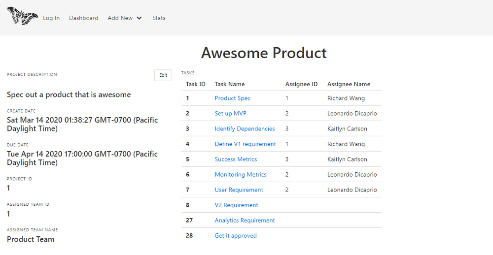
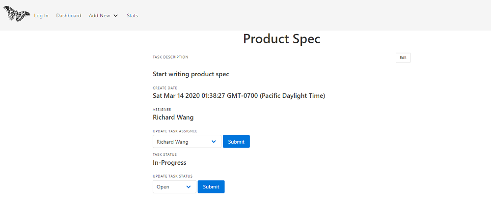
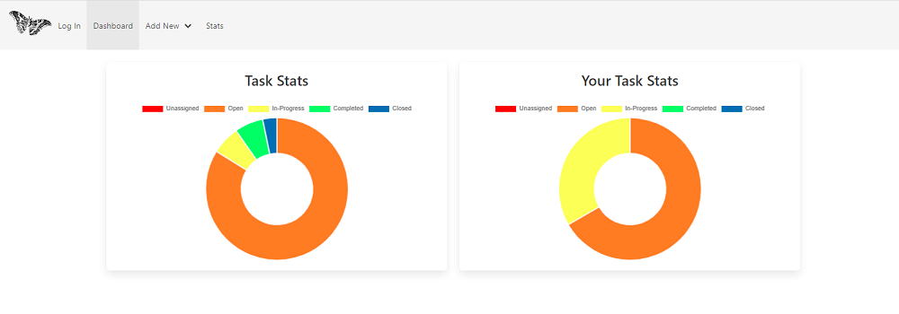

# Mothra Project Management Application
Inspired by JIRA!

## Table of contents
* [User Story](#user-story)
* [General info](#general-info)
* [UML](#uml)
* [Screenshots](#screenshots)
* [Setup](#setup)
* [Technologies](#technologies/packages)
* [Code Documentation](#code-documentation)
* [Future Development](#future-development)
* [Credits](#credits)
* [Authors](#authors)
* [License](#license)

## General info
This project is a web application that allows a team to track their project development progress, issues, total number of tasks, and present that information in a web dashboard. Mothra allows users to create projects which are assigned to a team. A team consists of multiple users/employees. Users can also create tasks for a specific project. Each project consists of many tasks. Each task can be assigned to one user/employee, whose team is responsible for the project. Each task has state of (new, in-progress, complete, closed).

We decided to create this application because people are familiar with this software. (most technology companies use this type of application in one form or another). It is easy for people to understand what it does and its value.

## User Story
AS A developer
I WANT an application that keeps track of the project progress and issues
SO my team can have a good visibility of work status and develop more effectively

## UML


## Screenshots 






Link to the deployed application: https://the-best-project-manager.herokuapp.com/

## Setup
To run the program locally the user can fork the repository at https://github.com/maximilianc88/Project-Planner-Application and use the following command to install dependencies required:
```sh
npm install
```
The application is then invoked with the following command:
```sh
node server.js
```
There are also unit tests via the jest testing framework included to test that the client-side javascript is working as intended. Those tests can be run with the following command:
```sh
npm run test
```
## Technologies/Packages
This project is created with: 
* Bulma
* CSS 
* Chart.js
* Express
* Font Awesome
* Handlebars
* JavaScript
* jQuery
* mySQL
* Sequelize

## Code Documentation
Chart.js was a new technology that we implemented in this project to display our data in a new way.  We had to use a get request to grab our data and then some simple javascript to display it as different pieces of the chart in distinct colors:
```sh
function getData() {
  $.get(`/api/tasks`, data => {
    for (let i = 0; i < data.length; ++i) {
      if (data[i].status_code === 1) {
        open += 1;
      }
      if (data[i].status_code === 0) {
        unassigned += 1;
      }
      if (data[i].status_code === 2) {
        inProgress += 1;
      }
      if (data[i].status_code === 3) {
        complete += 1;
      }
      if (data[i].status_code === 4) {
        closed += 1;
      }
    }
  }).then(() => {
    const chartCanvas = document
      .getElementById(`myChartTeamProjects`)
      .getContext(`2d`);
    window.chartColors = {
      red: `#FF312B`,
      orange: `#FF8438`,
      yellow: `#FBFF4F`,
      green: `#4EFF51`,
      blue: `#156CB3`
    };
    // eslint-disable-next-line no-unused-vars
    const chart1 = new Chart(chartCanvas, {
      // The type of chart we want to create
      type: `doughnut`,
      // The data for our dataset
      data: {
        labels: [`Unassigned`, `Open`, `In-Progress`, `Completed`, `Closed`],

        datasets: [
          {
            label: `My First dataset`,
            backgroundColor: [
              window.chartColors.red,
              window.chartColors.orange,
              window.chartColors.yellow,
              window.chartColors.green,
              window.chartColors.blue
            ],
            data: [unassigned, open, inProgress, complete, closed]
          }
        ]
      },

      options: {}
    });
  });
}
```
Our models for this application were somewhat complex in terms of the relationships between them.  The tasks model for example had 4 different associations:
```sh
 Task.associate = function (models) {
    Task.belongsTo(models.Status, {
      targetKey: `status_code`,
      foreignKey: { name: `status_code`, allowNull: false, defaultValue: 0 },
      constraints: false
    });
    Task.belongsTo(models.Project, {
      targetKey: `id`,
      foreignKey: { name: `project_id`, allowNull: false },
      constraints: false
    });
    Task.belongsTo(models.User, {
      targetKey: `user_id`,
      foreignKey: { name: `assignee_id`, allowNull: true, defaultValue: null },
      constraints: false
    });
    Task.belongsTo(models.Team, {
      targetKey: `id`,
      foreignKey: { name: `team_id`, allowNull: true, defaultValue: null },
      constraints: false
    });
  };
```

## Future Development 
The application currently enables the user to create new projects and tasks, view existing projects and tasks, and edit and delete projects and tasks. They can also view the status of projects and their individual tasks using a doughnut chart. The application has a basic login and create account feature with future development plans to add logout (currently to clear the cookie you just log in again as a different user) as well as real validation of the user's account creation and login information. We also plan to add click events on the doughnut charts, so that when the user clicks on a status it displays all the projects or tasks associated and upon clicking on the individual project or task name will navigate the user to the individual project or task page.  We also would like to add further restrictions on the models specifically adding restrictions as to who can assign, edit, delete projects and tasks. Another future feature is adding a chat application within the program as well as a help chat bot to assist users with issues and provide information about the program by way of frequently asked questions.  

# Credits
In creating this application we extensively consulted our UW course GitLab repository, Bulma (https://bulma.io/documentation/), Chart.js (https://www.chartjs.org/) Stack Overflow (www.stackoverflow.com), W3Schools (https://www.w3schools.com/js/js_cookies.asp), MDN Web Docs (https://developer.mozilla.org/en-US/docs/Web/API/Location/reload), Jest (https://jestjs.io/docs/en/mock-functions.html), SVG SiLH for our logo (https://svgsilh.com/image/1296745.html) and Sequelize (https://sequelize.org/master/identifiers.html). 

## Authors
This application was created by [@KaitlynCarlson](https://kaitlyncarlson.github.io/Updated_Portfolio/) | [@maximilianc88](https://maximilianc88.github.io/Wk-08-HW/index.html) | [@rachelrohrbach](https://rachelrohrbach.github.io/portfolio-website/) | [@phaggio](https://phaggio.github.io/)

## License
MIT License

Copyright (c) [2020] [Kaitlyn Carlson, Maximillian Cartwright, Rachel Rohrbach, Richard, Wang]

Permission is hereby granted, free of charge, to any person obtaining a copy
of this software and associated documentation files (the "Software"), to deal
in the Software without restriction, including without limitation the rights
to use, copy, modify, merge, publish, distribute, sublicense, and/or sell
copies of the Software, and to permit persons to whom the Software is
furnished to do so, subject to the following conditions:

The above copyright notice and this permission notice shall be included in all copies or substantial portions of the Software.


